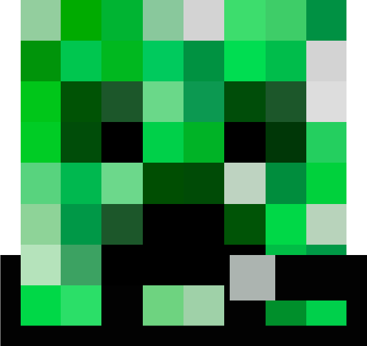

Welcome To my Profile !

Other Accounts 

Here is icons for tags:
*  for old accounts
*  for uncommon profiles
*  I don’t know

Accounts:
* [Scratch ](https://scratch.mit.edu/users/Noah-001122/)
* [Scratch ](https://scratch.mit.edu/users/GamerCreeper12)
* [Penguinmod ](https://penguinmod.com/profile/?user=gamercreeper12)

Language Skills

    

